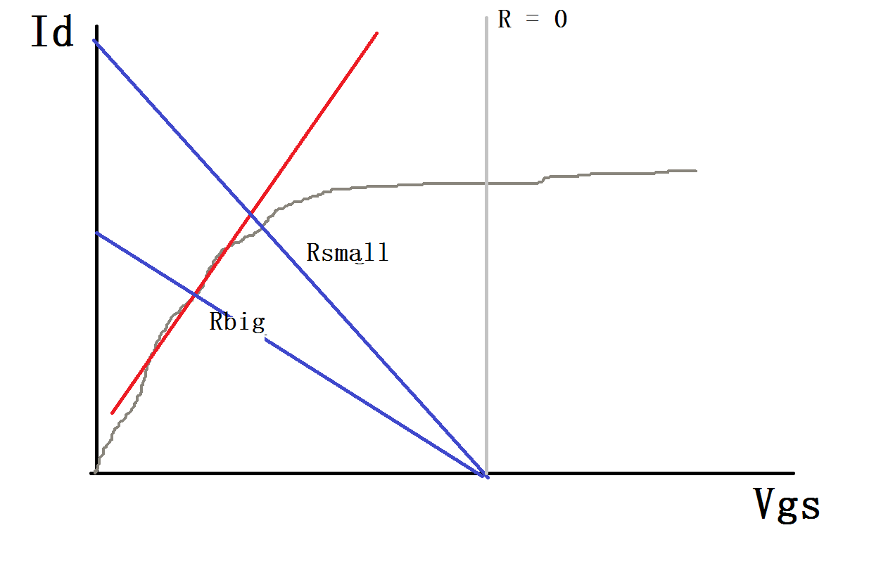

Installation Guide & Quick Start
======================================

Installation
--------------------------------------
The project is packed and distributed using python's setuptools. You can either clone the project from my `Github Repo <https://github.com/SleepBook/pySpice>`_ page or direct download the compressed file `here <../../../../dist/pySpice-0.1.zip>`_ (Not always up to data). Unzip it, then run::
	
	python setup.py install

The package should be installed to correct position and be available in your python environment. (you may need super-user privilege for installation).

Run the Program
--------------------------------------------
This project came with two scripts in stock. You can use these two scripts as command line programs. The first script, called *pyspice* is used to run the simulator and generate output, the syntax is::

	pyspice [-h/--help] [-p/--print] [-o/--output filename] netlist

the two options, if -p or --print is specified, the result will be plot immediately after the output text file is generated. If the -o or --output flag is on and an valid output file name is given. The analysis result will be written into that file. Otherwise, *out.ls* is used as the default name. The -h option will give you a brief usage introduction.

The other script called *result_viewer* is used to plot waveform from the analysis result. It simply equals runing the previous script without -p option and then call this script to plot the waveform. 

Run the Samples
-----------------------------------------------
Several samples can be found under the *data/sample_netlist* folder. You can run the scripts on these circuits to see the result. Here I list some:

Half Wave Ractifier(Single Diode)
++++++++++++++++++++++++++++++++++++++++++++++++

.. figure:: ../figures/diode.png

CMOS Inverter
+++++++++++++++++++++++++++++++++++++++++++

CMOS Buffer
+++++++++++++++++++++++++++++++++++++++++++

.. figure:: ../figures/buffer.png

